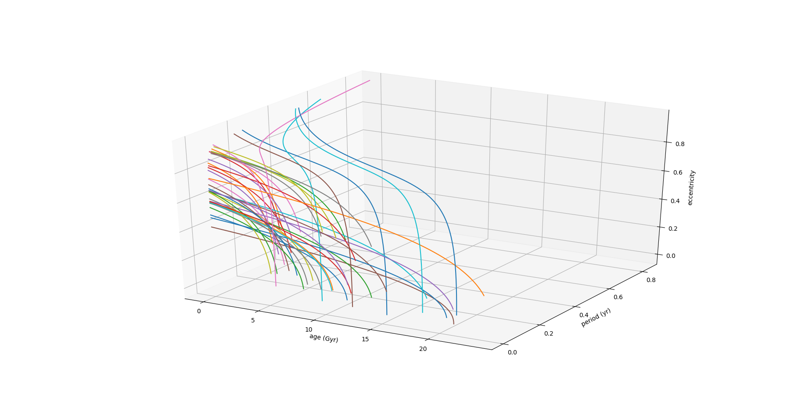

Quick Start Guide
=================

Getting started with Takahe is very straightforward: All you have to do is :code:`import takahe` to get going. From there, the three main classes you will encounter are:

1. :code:`takahe.BSS`,
2. :code:`takahe.ensemble`, and
3. :code:`takahe.universe`.

To create any of the three classes, just call :code:`.create()` on the relevant object (with the right parameters):

.. code-block:: python
  :linenos:
  
  import takahe
  my_universe = takahe.universe.create('eds')

Each class represents a different level of abstraction for the system. Most simulations will start by creating a Universe, and propagating individual BSS objects in the ensemble through time.

This quick start guide will guide you through the most common use cases for each class. It is not extensive, you are referred to the more advanced docs for more guidance.

Simulating the Universe
-----------------------

Takahe supports four different models of Universe:

+--------------+----------------------+------------------+------------------------+------------------+--------------+
| Model        | Long Name            | :math:`\Omega_M` | :math:`\Omega_\Lambda` | :math:`\Omega_k` | :math:`H_0`  |
+==============+======================+==================+========================+==================+==============+
| eds          | Einstein-de Sitter   | 1                | 0                      |                0 | customisable |
+--------------+----------------------+------------------+------------------------+------------------+--------------+
| lowdensity   | Low matter density   | 0.05             | 0                      |             0.95 | customisable |
+--------------+----------------------+------------------+------------------------+------------------+--------------+
| highlambda   | High :math:`\Lambda` | 0.2              | 0.8                    |                0 | customisable |
+--------------+----------------------+------------------+------------------------+------------------+--------------+
| lcdm         | Einstein-de Sitter   | 0.3              | 0.7                    |                0 | 70           |
+--------------+----------------------+------------------+------------------------+------------------+--------------+

To create a :math:`\Lambda\text{CDM}` universe, therefore, we can just go:

.. code-block:: python
  :linenos:

  import matplotlib.pyplot as plt
  import takahe
  my_universe = takahe.universe.create('lcdm')

Populating the Universe is also very easy! Just call :code:`.populate()` with the name of the file (and header-hints if you have them):

.. code-block:: python
  :linenos:
  :lineno-start: 4

  my_universe.populate("data/mydatafile.dat")

Takahe sniffs the filename you provide and tries to load the data correctly, though this can all be overridden. Namely, if the filename contains :code:`StandardJJ`, Takahe will assume you are using the StandardJJ prescription, and that the datafile is structured like this:

+----+----+----+----+--------+---------------+------------------+
| m1 | m2 | a0 | e0 | weight | evolution_age | rejuvenation_age |
+----+----+----+----+--------+---------------+------------------+

The full indiosyncracies of the loader are explaineed in :doc:`loading`.

We can now compute and plot the event rate of our universe over its history very easily:

.. code-block:: python
  :linenos:
  :lineno-start: 5

  my_universe.event_rate()
  plt.show()

Which will give you an event rate histogram similar to the one below:

<Todo: insert image>

The full code of this example is below:

.. code-block:: python
  :linenos:

  import matplotlib.pyplot as plt
  import takahe
  my_universe = takahe.universe.create('lcdm')

  my_universe.populate("data/mydatafile.dat")

  my_universe.event_rate()
  plt.show()

Simulating an Ensemble
----------------------

The next level is an ensemble. A universe can be thought of as an ensemble of stars endowed with some physical constants. If you don't care about those constants, you can work with the ensemble itself, exposed via the :code:`populace` attribute::

  ensemble = my_universe.populace

or you can create an empty ensemble yourself to populate later::

  ensemble = takahe.ensemble.create()

or you can directly load a file into an ensemble::

  ensemble = takahe.load.from_file('data/mydatafile.dat')

Whichever way you choose to do it, the resultant object is an instance of `takahe.ensemble.Ensemble` and can be manipulated reasonably easily. Say you want to loop through an ensemble and print out the details of a system that has a primary mass above :math:`1M_\odot`. That can be done like:

.. code-block:: python
  :linenos:

  ensemble = takahe.load.from_file('data/mydatafile.dat')
  
  for star in ensemble:
  	if star.get('m1') > 1:
  	  print(star)
  	  break

That will print something like::

  Binary Star System Parameters:
    - M1: 5.967e+30 kg
    - M2: 1.989e+30 kg
    - a0: 34775000000.0 km
    - e0: 0.7
    - Coalescence Time: 7215.963430365828 Gyr

Alternatively, you can trace your ensemble through phase space (a/e-space), with

.. code-block:: python
  :linenos:

  ensemble = takahe.load.from_file('data/mydatafile.dat')
  
  ensemble.track_through_phase_space()
  plt.show()

(a subset can be specified by passing the a 2-tuple named :code:`in_range` to the method)

This will give you a graph similar to this:

Simulating a single system
--------------------------

You can create a single binary star system and follow its evolution like so:

.. code-block:: python
  :linenos:

  # Units: Solar Units
  m1 = 2
  m2 = 1
  a0 = 70
  e0 = 0.7

  extra_terms = dict(
  	'weight': 1e-5,
  	'evolution_age': 1e7,
  	'rejuvenation_age': 1e6
  )

  star = takahe.BSS.create(m1, m2, a0, e0, extra_terms) 

  t, a, e = star.evolve_until_merger()

This returns three arrays: a time array (from 0 until coalescence), a semimajor axis array, and an eccentricity array.